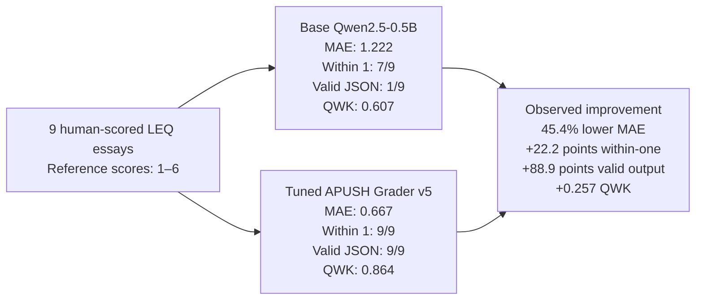

# APUSH FRQ Grader SLM

Train and evaluate a small open model for one narrow behavior: **grade APUSH LEQs** against the College Board 6-point rubric and explain each score with evidence grounded in the student's essay.

Behavior spec:

> The model is an APUSH LEQ grader and explainer. Given a prompt and student essay, it returns one valid JSON object with per-criterion scores (thesis, contextualization, evidence, analysis/reasoning) and short explanations that quote or paraphrase evidence from the student's text. It never invents historical facts, documents, or quotes; never rewrites the essay; and never inflates scores under student pressure.

## What Is Included

- `src/apush_frq_grader_slm/`: data generation, rubric validation, filtering, eval, and demo code.
- `scripts/train_qlora.py`: Unsloth QLoRA training on `Qwen/Qwen2.5-0.5B-Instruct`.
- `scripts/eval_hf_model.py`: held-out eval for a base or tuned Hugging Face model.
- `scripts/make_v2_dataset.py`: v2 data oversampling adversarial failure slices.
- `artifacts/data/`: generated train/eval JSONL and chat SFT rows.
- `artifacts/eval/`: deterministic baseline vs reference eval results.
- `docs/`: behavior spec, litmus test, eval report, and submission notes.

## Current V5 Status

V5 data is **approved and finalized**: 60/60 replacement rows passed human review and assembly
produced the hash-bound 540 train / 60 development / 75 replay corpus. The strict preflight passes
with zero golden leakage. GPU training and evaluation are complete. The strict release gate failed,
so v5 is **not production-ready**, but the independent practice comparison below shows clear
improvement over its Qwen base model.

## Base Qwen vs Tuned V5 — Nine-Essay Practice Result

The same nine human-scored essays from `LEQ_Grading_Practice.docx` were graded by prompted
`Qwen/Qwen2.5-0.5B-Instruct` and the frozen two-pass v5 bundle. These essays were not used for
training or checkpoint selection.

### LLM Litmus Test — Exact Total Scores

Each entry is the number of essays for which the model's predicted 6-point LEQ total exactly
matched the human score. The test uses three essays from each of 2023 LEQ 2 set 1, 2024 LEQ 3
set 2, and 2025 LEQ 3 set 1.

| LLM | 2023 | 2024 | 2025 | Total |
|---|---:|---:|---:|---:|
| Claude Sonnet 5 | 1/3 | 2/3 | 1/3 | 4/9 |
| ChatGPT (web) | 2/3 | 2/3 | 0/3 | 4/9 |
| Opus 4.8 | 3/3 | 2/3 | 1/3 | 6/9 |
| GPT 5.6 Sol | 3/3 | 2/3 | 1/3 | 6/9 |
| Qwen2.5-0.5B-Instruct | 0/3 | 0/3 | 1/3 | 1/9 |
| **USLM (tuned v5)** | **1/3** | **0/3** | **2/3** | **3/9** |



| Metric | Base Qwen | Tuned v5 | Change |
|---|---:|---:|---:|
| Mean absolute error | 1.222 | **0.667** | **45.4% lower** |
| Exact total score | 1/9 (11.1%) | **3/9 (33.3%)** | **+22.2 points** |
| Total within one point | 7/9 (77.8%) | **9/9 (100%)** | **+22.2 points** |
| Exact rubric rows | 16/36 (44.4%) | **26/36 (72.2%)** | **+27.8 points** |
| Quadratic weighted kappa | 0.607 | **0.864** | **+0.257** |
| Structurally valid output | 1/9 (11.1%) | **9/9 (100%)** | **+88.9 points** |

Video takeaway: fine-tuning produced a substantially better **grader**—more calibrated scores,
better rubric-row agreement, and reliable structured output. This is a directional external check
on only nine essays, not evidence of production readiness; the separate locked release gate still
failed and must be reported alongside this improvement.

## V5 Quick Start

```powershell
python -m pip install -e .
python scripts/review_v5_manual_packet.py --reviewer YOUR_NAME
python scripts/assemble_v5_dataset.py finalize --candidates artifacts/data/v5/private/validated_candidates_r2.jsonl
python scripts/smoke_v5_pipeline.py
python -m pytest
```

Then run `notebooks/colab_train_v5.ipynb` with the finalized private directory and completed v4
adapter in `/content/drive/MyDrive/apush-frq-grader-v5`. See
[`docs/v5_final_runbook.md`](docs/v5_final_runbook.md) for exact paths, frozen settings, evaluation
policy, privacy rules, and release commands.

## Data v2 Pipeline

The v2 path replaces duplicate short templates with persona-driven essays and independent
labels. It uses 60 original prompt families, keeps whole families out of train, and blocks final
artifacts until strict leakage, provenance, consensus, and human-review gates pass.

```powershell
python scripts/build_prompt_catalog.py --protected-prompts artifacts/data/eval_cb_cases.jsonl
python scripts/gen_realistic_tasks.py --limit 100
python scripts/generate_synthetic_candidates.py --limit 100
python scripts/audit_synthetic_candidates.py
python scripts/grade_synthetic_candidates.py --limit 100
python scripts/assemble_realistic_dataset.py
python scripts/review_synthetic_v2.py --create-template
# Complete artifacts/reviews/synthetic_v2.jsonl, then:
python scripts/review_synthetic_v2.py
python scripts/build_v2_artifacts.py --target-count 100
python scripts/run_v2_checkpoints.py                 # prepare 200/500/1200 subsets
# Add --execute on a GPU machine to train and evaluate every available checkpoint.
```

`generate_synthetic_candidates.py` and `grade_synthetic_candidates.py` require the `judge` extra
and `OPENAI_API_KEY`. Offline reader outputs can be resolved with
`scripts/resolve_synthetic_grades.py`. Official College Board artifacts have a separate written-
permission and manual-review gate; see `docs/data_permission_checkpoint.md`.

## V3 Failure-Driven Pipeline

V3 keeps v2 reproducible and adds a separate layered grader, immutable 200-row audited training
artifact, assistant-only training, checkpoint generation evaluation, and a locked official split.
The model emits four scores plus four feedback strings; the application computes `total` and never
clamps or otherwise changes a selected criterion score.

```powershell
python scripts/analyze_v2_for_v3.py
python scripts/build_v3_dataset.py artifacts/data/train_cases.jsonl artifacts/data/v2/train_realistic_v2.jsonl artifacts/data/v2/train_adversarial_v2.jsonl
python scripts/eval_v3.py --model Qwen/Qwen2.5-0.5B-Instruct --model-name Qwen2.5-0.5B-base
python scripts/benchmark_v3_dev.py --base-summary PATH_TO_BASE_SET1_SUMMARY
python scripts/train_v3.py --model Qwen/Qwen2.5-0.5B-Instruct --output artifacts/models/qwen-0.5b-v3 --dev-eval-command "python scripts/eval_v3.py --model {checkpoint} --model-name qwen-0.5b-v3 --output-dir artifacts/eval/v3/qwen-0.5b"
python scripts/train_v3.py --model Qwen/Qwen2.5-1.5B-Instruct --output artifacts/models/qwen-1.5b-v3 --dev-eval-command "python scripts/eval_v3.py --model {checkpoint} --model-name qwen-1.5b-v3 --output-dir artifacts/eval/v3/qwen-1.5b"
```

`eval_v3.py` always selects the 27 set1 rows unless `--final-evaluation` and an exact passing lock
manifest are both supplied. A successful set2 run writes a receipt that prevents a second run.
The local 53-row College Board-derived file still carries the provenance and extraction warnings
reported in `docs/v2_failure_analysis_for_v3.md`; saved v2 results are diagnostics, not golden data.

## V5 Two-Pass Pipeline

V5 inherits the merged v4 adapter as the base, then trains **separate scorer and feedback** LoRA
adapters. Runtime still returns one JSON object (`scores`, deterministic `total`, grounded
`feedback`) via two internal passes. The dataset goal is **600 filtered cases** from ~1,500
score-blind candidates (30×50 shards).

**Data** (see `docs/v5_external_data_contract.md` and
`docs/v5_authentic_essay_regeneration_plan.md`):

The deterministic composer is retired from production. Writers received full matched golden
essays as private style references. Generation and pilot review are complete; the remaining gate
is personal review of all 60 replacement rows and a new hash-bound finalization.

```powershell
python scripts/plan_v5_tasks.py
python scripts/report_v5_r1_authenticity_failure.py
python scripts/export_v5_generation_packets.py --fact-cards PATH_TO_PRIVATE_FACT_CARDS --pilot-only
# independent cloud writers return {task_id, student_response}; then:
python scripts/validate_v5_pilot_hard_gates.py --essays artifacts/data/v5/private/pilot_essays_v5.jsonl --audit artifacts/data/v5/private/pilot_hard_gate_audit_v5.json
python scripts/review_v5_pilot.py --reviewer YOUR_NAME
# After all 30 are accepted, export remaining packets (no --pilot-only), then:
python scripts/validate_v5_external_candidates.py --tasks ... --candidates ... --overlap-corpus ...
python scripts/assemble_v5_dataset.py prepare-review --candidates artifacts/data/v5/private/validated_candidates_r2.jsonl
python scripts/review_v5_manual_packet.py --reviewer YOUR_NAME
python scripts/assemble_v5_dataset.py finalize --candidates artifacts/data/v5/private/validated_candidates_r2.jsonl
```

**Training / release** (GPU / Colab):

```powershell
# notebooks/colab_train_v5.ipynb orchestrates the full Colab path
python scripts/merge_v4_adapter.py --v4-adapter PATH --output artifacts/models/v5-inherited-base
python scripts/train_v5.py --task scorer --model PATH --data PRIVATE/train_cases_v5_with_replay.jsonl --eval-data PRIVATE/dev_cases_v5.jsonl --private-dir PRIVATE --golden-cases artifacts/data/eval_cb_cases.jsonl --output artifacts/models/v5-scorer
python scripts/train_v5.py --task feedback --model PATH --data PRIVATE/train_cases_v5_with_replay.jsonl --eval-data PRIVATE/dev_cases_v5.jsonl --private-dir PRIVATE --golden-cases artifacts/data/eval_cb_cases.jsonl --output artifacts/models/v5-feedback
python scripts/rank_v5_checkpoints.py   # scorer/feedback checkpoint selection
python scripts/package_v5_bundle.py --bundle PATH --inherited-base ... --scorer ... --feedback ...
python scripts/eval_v5.py --bundle PATH --eval-path PATH --output-dir artifacts/eval/v5
python scripts/check_v5_release.py --summary PATH_TO_SUMMARY
python scripts/smoke_v5_pipeline.py     # CPU-friendly contract smoke (no GPU train)
```

**Release gates** (all required; failure ⇒ non-production-ready, do not retune on golden):
QWK ≥ 0.40, total MAE ≤ 1.50, ≥60% totals within one, every criterion exact-match > v4,
mean predicted total within 0.50 of the golden mean, structured validity ≥ 98%, grounding ≥ 85%.

**Privacy:** essays, style excerpts, per-case labels, and review packets under
`artifacts/data/v5/private/` are not committed — only aggregate audits may be shared.

**Golden eval note:** the 53-case golden evaluation is **development-informed** because capped
style excerpts shaped synthetic generation; treat it as contaminated relative to a fully blind holdout.

**Frozen configuration:** scorer 4 epochs / 1e-4 / score-token weight 4.0; feedback 2 epochs /
5e-5; LoRA rank 16; batch 1; gradient accumulation 4; warmup 0.03; max length 4096; seed 13.

**Public targets (not yet published):** model `aryanjverma/apush-frq-grader-v5`, companion dataset
`aryanjverma/apush-leq-grader-public`, and Space `aryanjverma/apush-frq-grader-v5-demo`. The built
companion under `artifacts/public/apush-leq-grader-public/` contains 1,000 project-authored
synthetic baseline rows and is explicitly **not** the private v5 corpus. Current run status is in
[`docs/v5_run_report.md`](docs/v5_run_report.md); the demo outline is
[`docs/v5_demo_storyboard.md`](docs/v5_demo_storyboard.md).

## Day 2 Smoke Test (50 cases, full loop)

Proves generate → train → eval on a tiny dataset before the real v1 run:

```powershell
python -m pip install -e ".[train]"
python scripts/run_smoke_pipeline.py
```

This writes 30 train / 20 eval rows to `artifacts/smoke/`, fine-tunes a LoRA adapter to
`artifacts/models/apush-frq-grader-v1-smoke/` (CPU-friendly via `scripts/train_smoke.py`),
and evaluates baselines plus the tuned model under `artifacts/smoke_eval/`.

To re-run eval only (adapter already trained):

```powershell
python scripts/run_smoke_pipeline.py --skip-generate --skip-train
```

## Train With QLoRA

Run on a GPU machine after installing training extras:

```powershell
python -m pip install -e ".[train]"
python scripts/train_qlora.py --model Qwen/Qwen2.5-0.5B-Instruct --data artifacts/data/train_chat.jsonl --output artifacts/models/apush-frq-grader-v1
python scripts/eval_hf_model.py --model artifacts/models/apush-frq-grader-v1 --model-name apush_frq_grader_v1 --eval-path artifacts/data/eval_cb_cases.jsonl --real-eval
```

## Current Deterministic Eval (198-case held-out set)

On the same eval harness used for the litmus test:

| Model | Cases | JSON Valid | Rubric Acc. | Grounding | Robustness | Total |
|-------|-------|------------|-------------|-----------|------------|-------|
| `inflated_prompted_base` | 198 | 1.00 | 0.82 | 0.17 | 0.93 | 0.69 |
| `apush_grader_reference` (SFT target) | 198 | 1.00 | 1.00 | 1.00 | 2.00 | 1.00 |
| `apush_frq_grader_v1` (QLoRA) | 198 | TBD | TBD | TBD | TBD | TBD |

The inflated baseline simulates a lenient prompted model: valid JSON but generic feedback and score inflation on weak essays. Fine-tuning should close the gap to the reference grader on grounding and adversarial slices.

### Smoke tuned model (Day 2 loop, 20-case held-out set)

| Model | Cases | JSON Valid | Rubric Acc. | Grounding | Robustness | Total |
|-------|-------|------------|-------------|-----------|------------|-------|
| `inflated_prompted_base` | 20 | 1.00 | 0.84 | 0.15 | 0.90 | 0.69 |
| `apush_grader_reference` (SFT target) | 20 | 1.00 | 1.00 | 1.00 | 2.00 | 1.00 |
| `apush_frq_grader_smoke` (QLoRA) | 20 | 0.55 | 0.95 | 0.95 | 1.65 | 0.77 |

`apush_frq_grader_smoke` is the Day 2 proof-of-loop adapter: LoRA fine-tuned on 30 synthetic train rows for 25 steps (`scripts/train_smoke.py`), evaluated on `artifacts/smoke/eval_cases.jsonl`. It confirms generate → train → eval works end-to-end and already beats the inflated baseline on grounding (0.95 vs 0.15) and total (0.77 vs 0.69). JSON validity is still low (0.55) because 25 steps on 30 examples is intentionally minimal — the full v1 run on ~997 rows is the real target.
