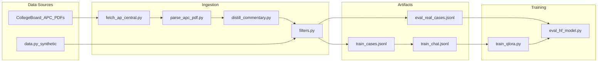

# LEQ Dataset Research and Training Integration Plan

Structured plan for ingesting official College Board APUSH LEQ samples, building a hybrid parser+distillation pipeline, and integrating with the existing synthetic SFT stack. See also [brainlift.md](../../brainlift.md) for project context.

## Implementation todos

| ID | Task | Status |
|----|------|--------|
| `catalog-fetch` | Create `scripts/catalog_ap_sources.py` to download and manifest 2023–2025 APUSH LEQ APC PDFs into `artifacts/raw/ap_central/` | pending |
| `apc-parser` | Build `src/apush_frq_grader_slm/ingest/apc_parser.py` with pdfplumber + unit tests on text fixtures | pending |
| `hybrid-distill` | Build `ingest/distill.py`: CB scores (deterministic) + LLM commentary rewrite to essay-anchored JSON, with `filters.py` quality gate | pending |
| `eval-real-artifact` | Produce `artifacts/data/eval_real_cases.jsonl` (~54 essays) via `scripts/ingest_ap_essays.py` — eval only, never train | pending |
| `mixed-dataset-cli` | Create `scripts/build_mixed_dataset.py` to generate ~1000 synthetic train rows + `train_chat.jsonl` without real essays | pending |
| `real-eval-metrics` | Extend `eval.py` and `scripts/eval_hf_model.py` with `--real-eval` and CB row agreement metrics | pending |
| `dataset-card` | Update `artifacts/dataset_card.md` with source inventory, licensing, and eval-only real essay policy | pending |

---

## Source inventory (research findings)

### Tier 1 — Official College Board (primary, use these)

All materials are free on [AP Central past exam questions](https://apcentral.collegeboard.org/courses/ap-united-states-history/exam/past-exam-questions). Each **Samples and Commentary** PDF follows a consistent structure:

| PDF pattern | Contents |
|---|---|
| `ap{YY}-apc-us-history-leq{N}-set-{S}.pdf` | LEQ prompt + 3 verbatim student essays + per-row scores + reader commentary |
| `ap{YY}-sg-us-history-set-{S}.pdf` | Full rubric decision rules (reference, not training rows) |

**Per PDF:** 1 prompt, 3 essays (typically high/mid/low), row scores (`Thesis Score: 0/1`, etc.), and prose commentary that often quotes student text.

**Estimated volume (public, 2023–2025):**
- 3 years × 2 sets × 3 LEQ questions (Q2, Q3, Q4) × 3 samples = **~54 essays**
- Digital APUSH (2025) independently validated this corpus: 18 essays from 2023–2024 with full CB rationales ([apush.omeka.net/2025](https://apush.omeka.net/2025))

**Why this is the right anchor:** Reader commentary teaches row-by-row calibration on contextualization and analysis/complexity — exactly where prompted baselines fail (thesis 84–94%, context/analysis much lower per Digital APUSH).

**Licensing:** College Board materials are publicly released for educational use; store source URLs and year/set/question IDs in metadata.

### Tier 2 — Educator reposts (secondary, same content, easier parsing)

These are reformatted College Board samples — useful as parsing validation, not additional unique essays:

- **Tom Richey** — labeled PDFs like `EXEMPLAR (6/6)`, `ABOVE-AVERAGE (5/6)`, `BELOW-AVERAGE (2/6)` ([example](https://www.tomrichey.net/uploads/3/2/1/0/32100773/2024_apush_leq_3_[set_1]_-_causes_of_changes_in_national_culture__1800-1848_.pdf))
- **Studocu / NUM8ERS / Spring Learning** — mirrors of official APC PDFs; useful for URL discovery, not unique data

### Tier 3 — Third-party prep (Barron's, Princeton Review, AMSCO)

Per [brainlift.md](../../brainlift.md), these expand argument diversity — but **no freely structured LEQ+row-feedback datasets** were found. Commercial workbooks have prompts and sometimes model essays, but lack College Board-style per-row reader commentary. **Do not scrape pirated copies.** If you later obtain licensed teacher editions, add a manual CSV importer using the same `FRQCase` schema.

### Tier 4 — Synthetic generation (fills the ~950-row training gap)

Existing pipeline in [`src/apush_frq_grader_slm/data.py`](../../src/apush_frq_grader_slm/data.py) already generates adversarial slices (`grade_inflation_request`, `prompt_injection`, `weak_thesis`, etc.) that released exams never cover. With ~54 real essays held out for eval, **~850–950 synthetic rows remain the training backbone**, matching the current v1 target.



---

## What each source contributes

| Source | Essays | Row scores | Essay-anchored feedback | Adversarial slices | Use |
|---|---|---|---|---|---|
| College Board APC PDFs | ~54 | Yes (official) | Yes (prose, needs translation) | No | **Eval only** |
| Synthetic `data.py` | ~850–950 | Yes (rule-based) | Yes (template) | Yes (~25%) | **Train** |
| Generated gaps | As needed | Yes | Yes | Yes | **Train** (oversample weak slices) |

**Eval strategy:**
- Keep **all ~54 real essays** in `artifacts/data/eval_real_cases.jsonl` — never mix into `train_chat.jsonl`
- Keep existing **198-case synthetic litmus** in `eval_cases.jsonl` for regression + adversarial slices
- Report two eval tracks: `litmus` (contract + adversarial) and `real` (external validity vs CB scores)

---

## Hybrid commentary translation

College Board commentary is human-oriented prose. Training targets must be JSON per [`behavior.py`](../../src/apush_frq_grader_slm/behavior.py) / [`rubric.py`](../../src/apush_frq_grader_slm/rubric.py):

```json
{
  "scores": {"thesis": 1, "contextualization": 1, "evidence": 2, "analysis_reasoning": 1},
  "total": 5,
  "feedback": {"thesis": "...", "contextualization": "...", "evidence": "...", "analysis_reasoning": "..."}
}
```

**Hybrid pipeline (3 steps):**

1. **Rule extraction (deterministic)** — parse PDF text with regex/section markers:
   - Prompt from scoring guidelines header (e.g., `Evaluate how sectional tensions...`)
   - Essay body between `Sample {ID}` markers and commentary section
   - Row scores from `Thesis Score: N`, `Contextualization Score: N`, etc.
   - Per-row commentary blocks (`A. Thesis/Claim`, `B. Contextualization`, ...)

2. **Feedback distillation (LLM-assisted, gated)** — for each row, prompt a teacher model:
   - Input: essay text + CB row score + CB commentary excerpt
   - Output: 1–2 sentence feedback that **quotes or paraphrases the student's essay** (matching synthetic `_reference_grade()` style in `data.py`)
   - Use CB scores as ground truth — do not let the LLM change scores

3. **Quality gate** — run [`passes_quality_gate()`](../../src/apush_frq_grader_slm/filters.py):
   - Valid JSON, score ranges, `feedback_references_essay()` overlap
   - Reject rows where distillation invents quotes not in essay
   - Flag low-confidence parses for manual review (expect ~5–10% of PDFs to need cleanup due to OCR/layout)

**Fallback when distillation fails:** Use rule-based templates from `data.py`'s `_reference_grade()` with CB scores injected — same scores, synthetic but grounded feedback.

---

## Implementation plan

### Phase 1 — Source catalog and fetcher

Create [`scripts/catalog_ap_sources.py`](../../scripts/catalog_ap_sources.py):

- Enumerate known PDF URLs for 2023–2025 LEQ APC files (pattern: `ap{yy}-apc-us-history-leq{2,3,4}-set-{1,2}.pdf`)
- Download to `artifacts/raw/ap_central/` with manifest JSON (`year`, `leq_num`, `set`, `url`, `sha256`)
- Optionally fetch Tom Richey PDFs as parse-test fixtures

### Phase 2 — PDF parser

Create [`src/apush_frq_grader_slm/ingest/apc_parser.py`](../../src/apush_frq_grader_slm/ingest/apc_parser.py):

- Use `pdfplumber` (add to `pyproject.toml` optional `[ingest]` extra)
- Extract structured `RawAPCSample` dataclass: `prompt`, `essay`, `scores`, `commentary_by_row`, `metadata`
- Unit tests with text fixtures extracted from known PDFs (commit small `.txt` fixtures, not full PDFs)

### Phase 3 — Commentary distiller

Create [`src/apush_frq_grader_slm/ingest/distill.py`](../../src/apush_frq_grader_slm/ingest/distill.py):

- `raw_sample_to_frq_case()` → `FRQCase` with `failure_type` inferred from total score:
  - 0–2 → `weak_thesis` or `evidence_list` (use commentary cues)
  - 3–4 → `borderline_complexity` or `missing_context`
  - 5–6 → `strong`
- `source` tag in metadata: `"ap_central_2025_leq3_set2_3A"`
- CLI: `scripts/ingest_ap_essays.py --input artifacts/raw/ap_central/ --output artifacts/data/eval_real_cases.jsonl`

### Phase 4 — Dataset merge for training

Create [`scripts/build_mixed_dataset.py`](../../scripts/build_mixed_dataset.py):

- Generate synthetic train pool via existing `generate_cases()` + `passes_quality_gate()`
- **Do not** merge real essays into train (eval-only policy)
- Output:
  - `artifacts/data/train_cases.jsonl` (~1000 synthetic)
  - `artifacts/data/train_chat.jsonl` via existing `to_chat_rows()`
  - `artifacts/data/eval_real_cases.jsonl` (~54 real)
  - `artifacts/data/eval_real_chat.jsonl` (for `eval_hf_model.py`)

Extend [`scripts/make_v2_dataset.py`](../../scripts/make_v2_dataset.py) to accept `--base-cases` so adversarial oversampling still works on synthetic pool.

### Phase 5 — Eval extension

Extend [`scripts/eval_hf_model.py`](../../scripts/eval_hf_model.py) and [`src/apush_frq_grader_slm/eval.py`](../../src/apush_frq_grader_slm/eval.py):

- Add `--real-eval` flag for `eval_real_cases.jsonl`
- New metric: **score agreement** vs CB row scores (exact match + ±1 per row, QWK if enough rows)
- Existing metrics (JSON validity, grounding, adversarial) still run on synthetic litmus only

### Phase 6 — Train (unchanged stack)

```powershell
python scripts/build_mixed_dataset.py --train-count 1000
python scripts/ingest_ap_essays.py
python scripts/train_qlora.py --data artifacts/data/train_chat.jsonl --output artifacts/models/apush-frq-grader-v1
python scripts/eval_hf_model.py --cases artifacts/data/eval_cases.jsonl          # litmus
python scripts/eval_hf_model.py --cases artifacts/data/eval_real_cases.jsonl     # real CB
```

Training format is already correct — no changes needed to [`train_qlora.py`](../../scripts/train_qlora.py) or [`train_smoke.py`](../../scripts/train_smoke.py).

---

## Expected outcomes and gaps

| Metric | Synthetic-only (current) | After this plan |
|---|---|---|
| Train rows | ~997 synthetic | ~1000 synthetic (unchanged composition) |
| Real eval rows | 0 | ~54 CB essays with official scores |
| Adversarial coverage | Strong (33 inflation, 29 injection) | Unchanged (synthetic only) |
| External validity | None | CB row agreement on real essays |
| Context/complexity calibration | Template-based | Eval measures whether SFT generalizes to real reader standards |

**Known limitations to document in [`artifacts/dataset_card.md`](../../artifacts/dataset_card.md):**

- Only ~54 real essays — sufficient for external validity signal, not for training
- Pre-2023 rubric wording differs slightly (2023–24 rubric update); filter to post-2023 PDFs for consistency with [`rubric.py`](../../src/apush_frq_grader_slm/rubric.py)
- College Board limiting AP Central to 3 most recent years — **download and archive now** before older PDFs move behind AP Classroom
- Barron's/AMSCO remain future manual-ingest if licensed copies become available

---

## Priority order

1. Archive all 2023–2025 APC PDFs (time-sensitive)
2. Build parser + hybrid distiller with tests on 2–3 known PDFs
3. Produce `eval_real_cases.jsonl` and validate against CB scores manually on 5 samples
4. Rebuild synthetic train set and run v1 QLoRA
5. Run dual eval (litmus + real) and compare to `inflated_prompted_base` and `apush_grader_reference`

---

## Cloud Agent handoff

Use this section when launching a [Cursor Cloud Agent](https://cursor.com/dashboard?tab=cloud-agents) against the repo.

### Before you launch

1. Commit and push this file (`docs/plans/leq_dataset.md`) to GitHub
2. Confirm Cloud Agents are enabled on your account
3. Cloud agents clone from remote — they cannot see uncommitted local work

### Launch steps

1. Open **Agent** in Cursor
2. Select **Cloud** (not Local)
3. Point at your GitHub repo + branch
4. Paste the prompt below
5. Review the PR when the agent finishes

### Copy-paste prompt

```markdown
Implement the LEQ dataset collection plan in this repo.

Read first:
- brainlift.md (project context)
- docs/plans/leq_dataset.md (this plan — follow it exactly)
- src/apush_frq_grader_slm/schemas.py, data.py, filters.py, behavior.py, rubric.py
- artifacts/dataset_card.md

Goal: Ingest official College Board APUSH LEQ samples (2023–2025) for external eval only. Train data stays synthetic.

Constraints (do not violate):
- ALL real AP essays → eval_real_cases.jsonl only — NEVER in train_chat.jsonl
- Hybrid translation: use College Board row scores as ground truth; distill prose commentary into essay-anchored JSON feedback
- Run passes_quality_gate() from filters.py on every row
- Match existing FRQCase schema and to_chat_rows() format
- Add pdfplumber as optional [ingest] extra in pyproject.toml
- Commit small .txt PDF text fixtures for tests; do not commit full College Board PDFs
- Do not scrape pirated Barron's/AMSCO content
- Follow existing code style; minimal scope

Implement in order:
1. scripts/catalog_ap_sources.py — download 2023–2025 ap{yy}-apc-us-history-leq{2,3,4}-set-{1,2}.pdf to artifacts/raw/ap_central/ with manifest
2. src/apush_frq_grader_slm/ingest/apc_parser.py + tests
3. src/apush_frq_grader_slm/ingest/distill.py — CB scores deterministic; LLM rewrite for feedback; fallback to _reference_grade() templates
4. scripts/ingest_ap_essays.py → artifacts/data/eval_real_cases.jsonl (~54 essays)
5. scripts/build_mixed_dataset.py — ~1000 synthetic train rows, no real essays in train
6. Extend eval.py + scripts/eval_hf_model.py with real-eval metrics (row agreement vs CB scores)
7. Update artifacts/dataset_card.md

Verification:
- pytest for new ingest tests
- ingest_ap_essays.py runs on downloaded PDFs
- Manually spot-check 3 parsed samples against source PDFs
- build_mixed_dataset.py produces train_chat.jsonl with 0 real-essay rows

Open a PR with summary, test plan, and known limitations.
```

### Phased runs (optional)

If one run is too large, split into three Cloud Agent sessions on the same branch:

| Run | Scope |
|-----|--------|
| **A** | Phases 1–2: PDF fetcher + parser + tests |
| **B** | Phase 3: Distiller + `eval_real_cases.jsonl` |
| **C** | Phases 4–5: `build_mixed_dataset.py` + eval metrics + dataset card |

### Notes

- **QLoRA training** requires a GPU — the cloud agent can implement the pipeline; run `train_qlora.py` locally afterward
- **LLM distillation** may need an API key; implement `--distill` flag so rule-only fallback works without one
- **Do not commit** API keys or full College Board PDF binaries
